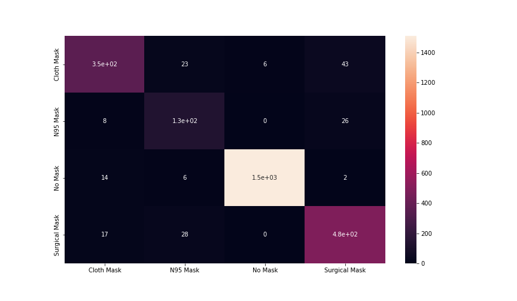
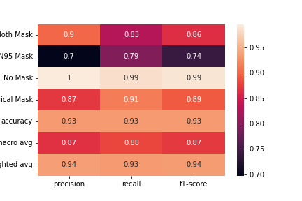

# Comp-472-FaceDetection

## Members
#### Christopher Pereira - (Data Specialist & Evaluation Specialist)
#### Sofiya Taver - 40095050 (Training Specialist & Compliance Specialist)
#### Anthony Tkalec - 40053361 - (Data Specialist & Training Specialist)

## Files
1. DatasetInformation.rtf: The following text file describes information about the dataset including where it was extracted from and how many images were inside the datset.
2. OutputImages-1.zip: Folder of images from dataset images to predicted outputs compared to actual output and metric tables like classification report and confusion matrix.
3. Part1_MaskDetector.ipynb: Main notebook where splitting, training, and evaluation of the model can be seen. The notebook is already ran so the outputs are already visible, should you want to run it again you must open the notebook in Google Colab and restart the kernel.
4. fileExtrator_MaskDetector.ipynb: Script used to extract the dataset, use unsupervised learning to cluster the dataset into proper folders, resized the image.
5. mask_detect_model.pth: The saved model that was trained on the dataset.
6. model_loader.ipynb: Following is a notebook with instructions on how to run the saved model on a sample dataset, along with a few of the metrics. Instructions are given at the top of the file. Again, to run open the notebook in Google Colab.
7. test.zip: Following is sample data taken from the test set to be used to test imported model.

## Training
To run our code, first you need to download the provided dataset. Then, you need to get the current location of the dataset file and change the path at cell 3,6,7 for this new path. This is because we reference teh google drive path which only we have access to. After, to save the model you must again specify your own location on cell 15. The training section is thus complete and you can run the notebook.

## Evaluation
For the evaluation results, you will also need to change the path at cells 17,19,22,23 if you want to save the outputed locally. Our code will generate a confusion matrix image and a classification report image in the location you will choose. When all the paths are changed, you can now press on “run”.

### Confusion Matrix

### Classification Report

